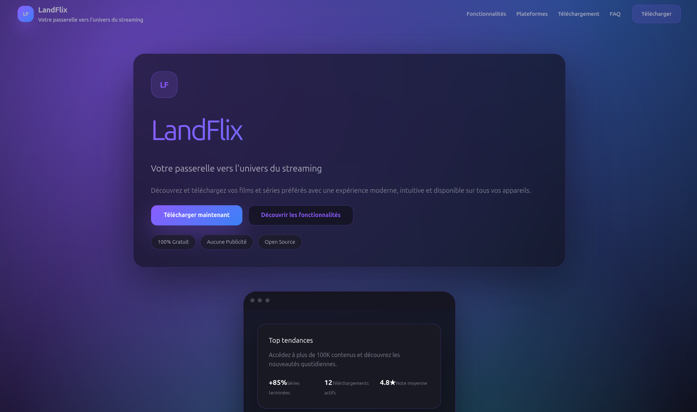

# LandFlix Landing Page



> Landing page officielle de **LandFlix**, l'application multiplateforme pour découvrir, télécharger et organiser vos films et séries préférés. Interface premium, animations fluides et design Material Design 3 adapté aux tendances 2025.

**🌐 Démo en ligne** : [https://starland9.github.io/landflix-landing](https://starland9.github.io/landflix-landing)

## ✨ Aperçu rapide

- 🎬 **Présentation produit** : sections Hero, fonctionnalités, statistiques, captures d'écran et téléchargements.
- 💻 **Multipériphérique** : mise en avant de la disponibilité Android, iOS, Windows, macOS, Linux et Web.
- 🪄 **Animations douces** : révélations au scroll via Intersection Observer et transitions CSS.
- 🧩 **Code modulaire** : composants isolés, données centralisées et styles via module CSS.
- 🌙 **Design sombre moderne** : palette violette/bleue, effets glassmorphism et typographie Outfit.

## 🗂️ Structure principale

```text
src/
└── app/
    ├── layout.tsx             # Layout global + métadonnées SEO/OG
    ├── globals.css            # Design system & resets
    ├── page.tsx               # Composition de la landing
    ├── page.module.css        # Styles spécifiques à la page
    ├── _components/landing/   # Composants de section (Hero, Stats, etc.)
    ├── _data/landingData.ts   # Contenus statiques typés
    └── _hooks/useScrollReveal.ts # Hook d’animation au scroll
```

## 🛠️ Stack technique

- [Next.js 15 (App Router)](https://nextjs.org/) avec rendu statique.
- [React 19](https://react.dev/) + hooks personnalisés.
- [TypeScript](https://www.typescriptlang.org/) pour la sécurité des types.
- [CSS Modules](https://nextjs.org/docs/app/building-your-application/styling/css-modules) + design tokens maison.
- [react-icons](https://react-icons.github.io/react-icons/) pour la bibliothèque d’icônes.
- [clsx](https://github.com/lukeed/clsx) pour la composition de classes.

## 🚀 Prise en main

1. **Installer les dépendances** :

```bash
pnpm install
```

1. **Lancer le serveur de développement** :

```bash
pnpm run dev
```

1. Ouvrir [http://localhost:3000](http://localhost:3000) pour voir la page.

1. Modifier les fichiers dans `src/app` : le rechargement se fait automatiquement.

## 📦 Scripts disponibles

- `pnpm run dev` – serveur de développement Next.js avec Turbopack.
- `pnpm run build` – build de production optimisé pour GitHub Pages.
- `pnpm run start` – serveur de production (après build).
- `pnpm run export` – génère l'export statique pour le déploiement.

## 📸 Mettre à jour les visuels

- Remplacez `public/preview.png`, `public/og-image.jpg` et `public/twitter-card.jpg` par vos assets finaux.
- Les placeholders de mockups (section Hero/Captures) se trouvent dans `page.module.css`.

## 🌐 Déploiement

### GitHub Pages (Recommandé)

Le projet est configuré pour le déploiement automatique sur GitHub Pages. Chaque push sur la branche `main` déclenche automatiquement le déploiement.

**URL de déploiement** : [https://starland9.github.io/landflix-landing](https://starland9.github.io/landflix-landing)

#### Configuration requise (une seule fois)

1. Allez dans **Settings** > **Pages** de votre dépôt GitHub
2. Sous **Source**, sélectionnez **GitHub Actions**
3. Le déploiement se fera automatiquement à chaque push sur `main`

#### Déploiement manuel

Vous pouvez aussi déclencher le déploiement manuellement :
1. Allez dans l'onglet **Actions** de votre dépôt
2. Sélectionnez le workflow **Deploy to GitHub Pages**
3. Cliquez sur **Run workflow**

#### ⚠️ Dépannage

Si vous voyez le README au lieu de la landing page :
1. Vérifiez que **Settings** > **Pages** > **Source** est configuré sur **GitHub Actions**
2. Vérifiez que le workflow dans l'onglet **Actions** s'est terminé avec succès
3. Attendez 2-3 minutes et videz le cache de votre navigateur (Ctrl+F5)

Pour plus de détails, consultez [GITHUB_PAGES_SETUP.md](./GITHUB_PAGES_SETUP.md).

### Autres plateformes

La page est statique : un `next build` génère le HTML. Vous pouvez aussi déployer sur Vercel, Netlify, Cloudflare Pages ou tout service supportant les sites statiques.

## 🤝 Contribution

1. Fork du projet
2. Création d’une branche : `git checkout -b feature/nouvelle-section`
3. Commit : `git commit -m "feat: ajouter section partenaires"`
4. Push : `git push origin feature/nouvelle-section`
5. Ouvrir une Pull Request

## 📄 Licence

Projet maintenu par **Landry (Starland9)**. Consultez les conditions de réutilisation avant distribution.

---

💬 Besoin d’aide ou envie de contribuer ? Ouvrez une issue sur le dépôt GitHub ou contactez Landry.
